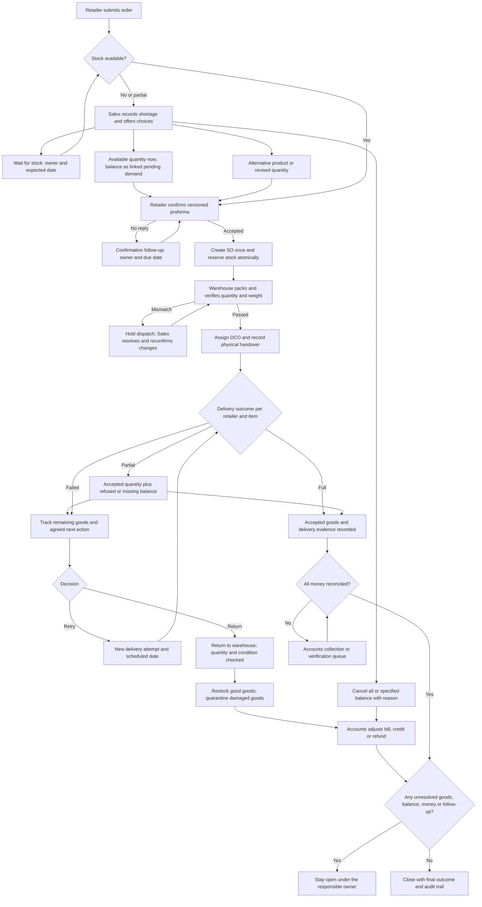

# WhatsApp orders: incomplete-order and closure flow

Prepared 18 September 2026. This document records the complete exception-flow specification. The stock-shortage workflow described in decision 1 is implemented; later exception stages remain planned.

Scope assumes all incomplete WhatsApp orders: stock shortage, no confirmation, packing problems, delivery failure, partial delivery, cancellation, returns, payment and refund pending. Non-WhatsApp sales orders retain their existing flow and remain hidden from Warehouse Manager accounts under the current visibility rule.

## Agreed decision 1: stock shortage

Confirmed with the user after the initial audit. This decision takes precedence over the generic shortage options below; the stock-shortage workflow is implemented.

- Sales owns the retailer-facing shortage case and coordinates the available and pending portions.
- Example: retailer requests 60, available quantity is 24, short quantity is 36.
- Send the retailer confirmation for the available 24, and a separate pending message for the short 36. A confirmation request is not an automatic dispatch.
- Offer the retailer the three choices: available now with balance later; wait for the entire quantity; available now with balance cancelled. Sales handles the retailer's decision; Purchaser approval must not override it.
- On detecting shortage, automatically create a draft purchase order for the short quantity and alert the Purchaser for approval. It is an approval request, not an already approved supplier commitment.
- If Purchaser approves, track replenishment until stock is physically received and available. Approval alone must not label the pending goods available or fulfilled.
- Once the upstream process has made the pending quantity available, send its confirmation to the retailer. If the retailer chose to wait for the full quantity, confirm the full quantity when available.
- If Purchaser cancels the draft PO, the case remains assigned to Sales. Sales resolves the available-now/balance-cancelled versus available-now/balance-pending choice with the retailer. Cancelling procurement must not silently cancel retailer demand.
- Keep the remaining 36 linked to the original demand until supplied or explicitly cancelled. Do not mark the complete retailer order fulfilled merely because the available 24 were confirmed or sent.
- Supplier selection, procurement consolidation, promised dates and reminder timings are not decided by this agreement; do not invent commitments for them.

## The closure rule

An order is closed only when every requested item has a recorded outcome, all dispatched goods have a recorded destination, and every financial obligation is reconciled. Creating an SO, sending a WhatsApp message, receiving a payment screenshot, or finishing a delivery route does not close the order.

Maintain three independent statuses:

1. Order: awaiting confirmation / confirmed / partly fulfilled / fulfilled / cancelled.
2. Goods: awaiting stock / packing / dispatch ready / in transit / delivered / return pending / returned and checked.
3. Money: not due / collection pending / partly collected / verification pending / reconciled / refund or credit pending.

Overall status is Open, Action Required, or Closed. A delivered order with unpaid money stays open for Accounts; it does not stay in the warehouse packing queue.

## Flow

## Exception decisions and responsibility

| Trigger | Required options / next action | Owner | Completion condition |
|---|---|---|---|
| No stock | Wait with expected date; propose alternative; cancel with reason | Assigned salesperson; Purchaser owns any replenishment task | Retailer confirms a revised order or explicitly cancels |
| Part stock | Supply available stock and keep balance pending; wait for full quantity; cancel balance | Sales | Both supplied and remaining quantities have explicit outcomes |
| Retailer silent | Follow-up with next-action date; escalate overdue; cancel only by an authorized decision | Sales, then Admin | Recorded acceptance or cancellation; no silent expiry |
| Price, item or quantity change | New proforma version; invalidate old buttons; request fresh acceptance | Sales | Latest version accepted; previous version cannot create an SO |
| Packing shortage or wrong weight | Record actual count/weight; block dispatch; recount or revise order | Warehouse, then Sales | Goods match the accepted order or retailer accepts revision |
| No delivery agent / missed pickup | Assign or reassign agent; set pickup date; retain packing record | Delivery Manager | Physical handover recorded against the assigned attempt |
| Shop closed / retailer unavailable / wrong address | Record reason and goods location; retry date or return | Delivery agent records; Delivery Manager resolves | Successful retry or goods received back at warehouse |
| Retailer refuses full order | Record refusal reason; return goods; resolve bill and advance payment | Delivery Manager, Warehouse, Accounts | Goods and money both reconciled |
| Partial delivery / item rejection | Record accepted, refused, damaged and missing quantity per item | Agent, Warehouse, Sales and Accounts for their respective steps | Every item and every remaining rupee reconciled |
| Delivered, payment pending | Keep collection case with amount, collector and due date | Collection Agent / Accounts | Verified settlement, or separately authorized documented adjustment |
| Cash collected, not handed over | Track agent cash separately from customer debt | Agent, then Accounts | Cash handover counted and acknowledged once |
| UPI or cheque submitted | Keep verification pending; failed/bounced payment reopens collection | Accounts | Verified payment applied once to the correct order |
| Cancel before dispatch | Release only existing reservation; resolve any advance/refund | Sales/Admin, Warehouse, Accounts | No reserved goods or pending financial obligation |
| Cancel after dispatch | Return flow, not immediate stock restoration | Delivery Manager, Warehouse, Accounts | Physical return inspection and financial adjustment complete |
| Goods lost or damaged in transit | Incident record, evidence and responsible party; approved disposition | Delivery Manager/Admin and Accounts | Loss disposition and money adjustment recorded |
| WhatsApp send fails | Durable notification retry linked to the same business event | System retry; Admin if exhausted | Delivery status recorded or alternative contact logged |

Default reminder intervals and retry limits must be configurable. Do not assume a timeout authorizes cancellation, a write-off, a refund, or a new dispatch.

## Quantity and money controls

- Keep original requested quantity even when approved quantity is reduced. Do not delete excluded lines: mark them pending, substituted, or cancelled with reason.
- For each original demand line: requested quantity = accepted-and-kept quantity + open quantity + explicitly cancelled quantity. A replacement is linked to the original demand; it is not counted as additional demand.
- Track goods custody separately: cumulative outbound units must equal units retained by the customer, physically returned, still in transit, or recorded as an approved loss/disposition. Link repeat dispatches to delivery attempts so one unit is not counted twice in customer demand.
- Reserve only available stock inside the SO transaction. On cancellation release reservation once. Goods already outside the warehouse return to available stock only after receipt and inspection; damaged items remain blocked.
- Partial fulfilment creates a linked balance case. Do not automatically charge freight twice or copy the full original invoice total to the remaining order. Show revised amounts for approval.
- Customer balance is based on the final charges, credits, verified collections and refunds. Agent-held cash is a separate obligation and must not cause duplicate customer collection.
- Existing retailer permissions for partial payment, later collection and cheque continue to apply. Unauthorized exceptions require an explicit Admin decision.
- A “refund pending” case is not closed by a promise. Record refund amount, method, reference and verification.

## One pending-work queue, filtered by role

Every exception has a persistent case ID linked to the original draft, SO, line, DCO/stop and attempt as applicable. Mandatory fields: reason code, affected quantity/amount, owner, next action, due date, current status and event history. Completion requires evidence or an explicit reasoned decision.

Views:

- Sales: stock shortages, confirmation follow-ups, changes and unresolved balance demand.
- Warehouse: WhatsApp packing holds and physical return receipts. Financial follow-up stays with Accounts.
- Delivery: missed pickups, failed stops, retry schedules and goods awaiting return.
- Accounts: unpaid amounts, unverified payments, agent cash handover, credit and refund cases.
- Admin: all overdue, unassigned and repeatedly failed cases, plus unresolved closure blockers.

Queues must include old unresolved work regardless of the dashboard's usual seven-day order date filter. A handoff requires a valid active owner; if that person is removed or inactive, the case escalates for reassignment rather than disappearing.

Suggested commands/screens: Pending Orders, My Actions, Overdue, Stock Pending, Retry Delivery, Return Receipt and Close Review. Buttons validate current role, ownership, order version and state on the server.

## Reliable transitions

- Claim actions and update order, reservation and event records in one transaction. Use stable idempotency keys for webhook messages, confirmations, payment references, returns and delivery attempts.
- Persist the business decision first and enqueue the notification in an outbox. A WhatsApp network error must not revert a successfully created SO to awaiting confirmation or create a second SO on retry.
- Revalidate stock and pricing at acceptance. Two retailers cannot reserve the same available units.
- Record attempted deliveries as separate immutable attempts. A retry cannot overwrite the previous failure or move already delivered quantities back into transit.
- Cancellation cannot run concurrently with a successful dispatch. Repeated cancel/return/payment actions have no second financial or stock effect.
- Close is a guarded operation: no pending demand, reservation, goods return, custody discrepancy, collection, verification, refund, cash handover or exception task remains.
- Closed outcomes distinguish fully fulfilled, partially fulfilled with balance cancelled, cancelled before dispatch, and returned/refunded. A later complaint or charge failure reopens a linked case with history preserved.

## Gaps found in the existing implementation

1. `finalizeDraft` uses draft status `Completed` once the sales cart is created. The UI labels this “Completed orders”; the end-to-end status needs to distinguish SO created from operational/financial closure.
2. `reviewWhatsAppDraft` can reduce approved quantity and delete omitted draft lines. It does not create a linked balance-demand case for the remainder.
3. `finalizeDraft` creates a sales cart before sending a notification, and its catch path resets the draft to awaiting confirmation. Business completion and notification retry need separate handling to avoid duplicate SO creation after a send error.
4. Delivery stops currently model delivery with a boolean and collection with Pending/Later/Collected. Explicit failed/partial attempts, retries and return custody are needed.
5. Sales returns insert inventory lots directly. A failed-delivery return needs physical receipt, condition checks, cumulative return limits and linked financial reconciliation.
6. Default snapshot order history spans seven days. Exception work needs a separate unresolved query so age does not hide pending cases.

Relevant implementation: `apps/api/src/whatsapp-integration.ts`, `apps/api/src/db.ts`, `apps/web/src/features/whatsapp/WhatsAppRetailerHub.tsx`, and `packages/domain/src/index.ts`.

## Delivery sequence and acceptance scenarios

Build in coherent stages, keeping an Admin pending-work view available from the first stage:

1. Durable cases, event history, role queues and guarded closure; correct “SO created” labeling.
2. Shortage/balance demand, confirmation versioning and atomic, idempotent SO creation.
3. Delivery attempts, partial acceptance, retry, return receipt and custody reconciliation.
4. Financial adjustments, payment verification, cash handover, refunds and notification outbox.

Acceptance scenarios:

- Request 60 soaps, stock 24: retailer chooses 24 now plus 36 later. All 60 stay accounted for until the 36 are delivered or explicitly cancelled.
- Same case, retailer cancels the remaining 36: that cancellation is recorded; there is no invisible lost demand.
- Two confirmations race for the same stock: total reservations never exceed availability.
- WhatsApp notification fails after SO creation: retry sends the update without creating another SO.
- Packed quantity differs from confirmed quantity: dispatch remains blocked until resolved.
- Shop closed: failure remains on the agent/manager queue, has a next action, and creates a new attempt for redelivery.
- Customer accepts 8 of 10: two units follow a tracked return or retry path; invoice and collection reflect the agreed outcome.
- Entire dispatched order refused: stock remains out until warehouse return receipt, and an advance refund remains open until verified.
- Replayed return scan/cancel/payment cannot create extra stock, refund, or collection.
- Customer paid cash: customer debt clears according to verification rules, but the agent's unacknowledged cash handover remains open.
- Cheque bounces or UPI verification fails: collection case opens with the correct remaining amount.
- Case older than seven days or assigned to an inactive user remains visible and escalates.
- One failed stop does not prevent independent successful stops from recording delivery; the DCO cannot claim fully resolved while goods or settlement remain outstanding.
- Warehouse sees only WhatsApp-origin operational cases; Admin/Accounts can reconcile all necessary records without exposing unrelated SOs to warehouse accounts.

## Stock-shortage implementation details

- The shortage register is visible on WhatsApp Home/Orders and on Purchaser Overview/Purchase/Purchases.
- Draft purchase orders are stored with their shortage case until a Purchaser supplies a supplier, purchase rates, GST rates and expected receipt date. Approval atomically creates the operational PO and purchase ledger entry. Default terms are supplier delivery and NEFT, stated in the approval form.
- A 30-second reconciliation worker detects existing reduced-quantity drafts, processes notifications and checks accepted stock receipts. Replenishment already on hand does not generate an unnecessary PO.
- If procurement is cancelled, Sales records whether the retailer wants the balance kept pending or cancelled. Kept demand can be released when physical stock becomes available, or Sales can request purchase approval again.
- Available and balance confirmations create their sales orders atomically and idempotently. The delivery charge is applied once across those portions. Existing committed WhatsApp quantities are excluded from available-to-promise stock.
- Notifications use persistent retry records. Failed notifications remain attached to the case and can be retried by Sales/Admin.
- The case remains in the register while confirmation, replenishment, fulfilment or payment verification is unresolved. No order-date cutoff applies to the register.
- Follow-up dates are explicit Sales actions. Automatic reminder frequency, supplier-side messages and the later delivery-failure/refund workflows are outside this stage.

## Supplier delay and partial receipt implementation

- Approved shortage POs are checked every 30 seconds. The register shows ordered, physically received and supplier-outstanding quantities by SKU.
- A partial receipt or missed expected-arrival date creates a persistent alert for the assigned Purchaser, Sales owner and WhatsApp Admin. Receipt/deadline signatures prevent a reminder on every poll. A changed receipt or a newly missed revised deadline creates a new alert.
- Sales records the retailer agreement: wait until a future revised arrival date, confirm accepted available stock and retain the rest, or cancel only the quantity without a prepared confirmation. The retailer receives the decision update.
- Warehouse-blocked quantities are not eligible for release. A partial receipt pauses release for Sales review. A complete accepted receipt can release the remaining balance automatically according to the existing choice.
- Each replenishment confirmation has its own linked draft. Only one unconfirmed replenishment portion is offered at a time; earlier confirmations remain valid and idempotent. Remaining demand excludes released portions, and the delivery charge is applied once across all portions.
- Cancelling retailer demand does not cancel a supplier commitment. The shortage case stays open while the linked supplier PO is unresolved; Purchaser resolves that PO through existing purchase controls.
- If procurement is cancelled after a partial delivery, Sales can retain or cancel the unreleased balance. A resubmitted purchase request recalculates the needed quantity instead of buying the already released quantity again.
- The additive schema migration links historical single-balance drafts once and does not reset partial allocations on restart.
- Validation uses isolated local PostgreSQL for transaction, quantity, retry, access-control and migration scenarios, plus desktop/mobile browser checks for Sales actions. No production test PO or receipt is created.

## Retailer confirmation follow-up implementation

- WhatsApp Home/Orders now includes a separate confirmation follow-up register for Sales and WhatsApp Admin. It includes every `Awaiting Retailer` draft regardless of age, including shortage portions.
- Sales explicitly sets a future follow-up date and note. No deadline is invented for existing orders: orders without a date remain visible as requiring scheduling.
- A 30-second worker generates one persistent overdue alert per follow-up version for the assigned Sales owner and WhatsApp Admin. Rescheduling supersedes obsolete reminders; successful recipient deliveries are not repeated when another recipient needs a retry.
- Sales can schedule, resend with a new date, or cancel the unconfirmed portion with a required reason. Resends and cancellation messages use a persistent retry queue with five automatic attempts and a staff retry action.
- Cancellation locks the draft and any linked shortage case in the same order as retailer confirmation. Processing/completed orders and drafts with an existing SO cannot be cancelled by this action. Cancellation is never automatic.
- Cancelling a shortage portion conserves requested = original available + outstanding/released balance + cancelled quantity. Other confirmed portions and unallocated demand remain linked. Cancelled replenishment drafts no longer block later eligible portions.
- Cancellation notification failures remain visible even after the draft becomes Denied. Shortage closure also waits for outstanding confirmation notifications.
- Historical change-order buttons cannot reopen a denied draft. Retailer clear preserves follow-up history once a confirmation is tracked. New proformas start a fresh follow-up cycle; resends preserve their newly scheduled date.
- Validation covers isolated PostgreSQL transactions, old-order visibility, ownership, overdue/retry versioning, cancellation/confirmation races and partial/full shortage accounting, plus desktop/mobile browser actions. Production verification is read-only.

## Packing recheck and amended bill implementation

- Warehouse starts with Recheck and records each line's actual quantity, missing/damaged reason, measured weight or a broken-scale declaration. An out-of-tolerance WhatsApp weight opens the same persistent review automatically.
- An open review blocks normal packing, dispatch and direct sales-order edits. Warehouse access follows warehouse scope; Sales owns commercial decisions; WhatsApp Admin monitors all cases without an order-date cutoff.
- A broken scale or weight outside tolerance requires a WhatsApp Admin override with a recorded reason. An override does not waive retailer acceptance of changed quantities.
- For reduced quantities, Sales chooses whether the balance remains pending or is cancelled and sends the proposed bill for retailer acceptance. Until acceptance and warehouse final confirmation, the original bill remains unchanged. Rejection returns the case to Sales; Sales can request another recheck.
- Warehouse explicitly confirms and finalizes after the required approvals. One transaction updates quantities, proportional discounts, tax, the ledger and positive-quantity dispatch dockets. Missing/damaged stock is blocked from reuse. Zero-quantity lines remain as cancelled history with zero amounts.
- Pending demand becomes a linked shortage draft. A delivery charge already retained on the fulfilled portion is waived on its balance. Parent shortage closure waits for the packing review, notifications and linked balance to resolve.
- An amount paid above the revised bill remains visible as Financial Review. Refund execution and verified financial closure belong to the later return/refund workflow and are not automated here.
- Staff alerts and retailer amendment/finalization messages have persistent retries. Replayed acceptance and finalization are idempotent; superseded retailer buttons cannot apply an older revision.
- Validation covers isolated PostgreSQL transactions and access controls, broken scales, rejected/stale amendments, reduced/all-zero quantities, inventory holds, linked balances and repeated finalization, plus desktop/mobile UI actions. Production verification is read-only.

## Delivery agent exception report and seller decision

- The delivery agent initiates Shop closed or Returned from an assigned outbound stop. Shop closed includes all dispatched goods. Returned allows selecting multiple products, entering each quantity and its reason, including other reasons.
- Reports persist as drafts. The agent can edit, save and review before explicitly confirming and sending to the seller. Submission locks agent edits until the assigned seller requests a correction. Stale revisions cannot overwrite a newer report; repeated submission does not duplicate alerts.
- WhatsApp offers product lists, quantity/reason entry, report review and confirmation. `EXCEPTIONS` opens reports. Seller decisions have their own review/confirmation step. The same records and actions are available under Delivery exceptions in BConnect, with a persistent Admin view.
- The assigned seller can authorize the listed return, request an agent correction, or schedule a dated retry for a closed shop. Notifications to the seller, assigned agent and WhatsApp Admin use a persistent retry queue. Failed alerts remain visible with a seller retry action.
- An unresolved report protects the affected stop and prevents whole-trip completion, reassignment or removal of that stop. Other stops can still progress. Reporting preserves the bill; seller approval atomically amends it to the accepted quantities. Physical inventory remains unchanged until warehouse receipt.
- Return Authorized remains open with custody assigned to the delivery agent. The confirmed agent report records unreturned quantities as accepted by the retailer. Seller approval adjusts the invoice and immediately unlocks collection. Warehouse receipt/counting and condition disposition follow the physical-return flow below; refund verification remains a subsequent stage. Seller approval and collection never restore stock or close the return custody case.
- Warehouse visibility retains the WhatsApp-origin restriction. Reports have no order-date cutoff. Validation covers PostgreSQL ownership, concurrent revision protection, item bounds, idempotent submission, stop holds and retry/return decisions; WhatsApp handlers and desktop/mobile app actions are also exercised without creating production reports.

## Immediate adjusted collection after seller approval

- The seller reviews returned and accepted quantities plus the proposed bill in WhatsApp or BConnect. Approval applies proportional discounts, GST and a single retained delivery charge; an all-returned order has a zero bill and zero delivery charge. Previous dispatched quantities remain in the report and dockets for custody reconciliation.
- One transaction updates accepted SO quantities, the ledger and the delivery stop. Already submitted/verified/resolved payments reduce the amount to collect. Any excess stays visible for financial review. Existing historical Return Authorized cases require explicit revised-bill approval before collection unlocks.
- The agent receives a persistent approval notification with the revised bill, already-paid amount, outstanding balance and a direct Collect payment button. BConnect displays the same approved amount and collection confirmation. The notification worker runs immediately after actions, with a three-second fallback sweep; the register refreshes every three seconds. Actual WhatsApp delivery still depends on the messaging provider.
- Drafts, corrections and pending seller approval block payment creation across the API, app and WhatsApp. Old bill amounts above the new outstanding balance are rejected. Payment creation serializes on the delivery task, deduplicates references, prevents concurrent overcollection and synchronizes the route collection state with recorded payments. Submitted payments remain subject to existing Accounts verification.
- Agent local drafts cannot override an approved bill or manufacture a paid state. Normal delivery controls defer exception stops to the exception register. Other stops can progress, while the trip and return case remain open for physical goods receipt.
- Validation includes real PostgreSQL transactions using the production payment functions, simultaneous approvals and payments, discounts/GST/advances, full returns and excess payments, WhatsApp approval alerts and collection routing, and mobile app approval/collection with an already-paid amount.

## Physical delivery returns: Warehouse Manager decision and photo evidence

- The assigned delivery agent must attach a visit photo for Shop closed, or a product-specific photo for every selected return, before confirming the report. Damage must be clearly photographed. Existing successful-delivery photo collection continues separately.
- After seller approval and immediate adjusted collection, the agent uploads a warehouse handover photo and confirms presentation. Custody remains with the agent until the scoped Warehouse Manager finalizes physical receipt. The manager receives a durable WhatsApp notification; the case remains visible to WhatsApp Admin without an age cutoff.
- In WhatsApp, use EXCEPTIONS, open the case, select Add photo / Handover photo / Receiving photos, then send an image. Photo-entry state survives restarts for 30 minutes. Product lists support paging. Authorized staff can view the persisted evidence in WhatsApp or BConnect; WhatsApp viewing uploads the stored image to Meta rather than exposing an unauthenticated image URL.
- Only a Warehouse Manager with access to the originating warehouse and WhatsApp-origin order can save or finalize the receiving decision. An Admin role alone does not authorize physical receipt. Record sellable and damaged quantities for every product, findings and any explicit decision for missing units. Counts above the authorized return require a recount. Every product requires warehouse receiving/condition evidence.
- The manager saves the count, reviews the expected/sellable/damaged/missing quantities and evidence, then confirms. WhatsApp count format is `1=2,1;2=3,0 | Findings`; append `| RESOLVE MISSING` only after recording the manager's final missing-quantity decision. BConnect provides individual quantity inputs and an explicit missing-quantity confirmation.
- Final receipt atomically creates linked sales-return records and stock lots: sellable units available, damaged units blocked, missing units never restored. Repeated/concurrent confirmation is idempotent. The already-adjusted bill and ledger are not credited again. The generic linked sales-return path rejects these cases to prevent duplicate stock and credit.
- Photos are validated JPEG/PNG/WebP (8 MB upload limit, 40 MP decode limit), normalized to JPEG and stored durably in PostgreSQL with stage, product, uploader, timestamp and SHA-256. Reads and writes enforce case/role/warehouse authorization. Receipt photos and finalized counts are immutable. Uploads do not reset in-progress count forms.
- Physical receipt releases the trip's return-custody hold. The return case closes only when verified/resolved payments equal the adjusted bill and no payments await verification. Pending collection, payment verification and prepaid excess remain Warehouse Received for financial follow-up; later payment reconciliation updates status and its audit/outbox. Refund execution remains the next workflow stage.
- Validation: isolated PostgreSQL tests exercise missing evidence, image validation, scope/ownership, handover, missing-unit decisions, stock disposition, concurrent receipt, unchanged billing and verified-payment closure. WhatsApp handlers exercise agent photo -> seller decision -> handover -> manager count/photo -> receipt. Mobile BConnect checks cover required photos, count/review/finalization and protected evidence preview without modifying production orders.

## Message failures and final order completion (items 10 and 12)

- All outbound WhatsApp messages enter a persistent outbox before a Meta request. Network errors, HTTP errors, and asynchronous failed-delivery webhooks retain the payload and recipient for retry. Workers claim messages with a lease; five failed attempts stop automatic retries. Staff can retry later. Transport can be at-least-once after an ambiguous network timeout; retries do not execute order or payment mutations.
- Only actual failed messages appear in the WhatsApp Home / Orders / Chats failure panel. The English fallback is: ?WhatsApp delivery failed. Record a manual follow-up note and retry later.? Save note for later persists the note and actor without claiming delivery or closing the order. Explicitly confirmed communication through another channel, with required details, resolves the notification obligation; it does not change delivery, stock or payment facts. Sales is limited to its retailers; WhatsApp Admin can see all failures. Successful messages have no failure prompt.
- Historical recorded failures are imported as Failed for staff review, not automatically resent. Retries of outdated retailer confirmation buttons are superseded. Delayed lower-priority delivery receipts cannot turn a failed or delivered message back into a simple Sent state.
- Both ordinary and shortage confirmations now use the same database transaction: all SO lines, ledger, draft link and order acknowledgement are committed together. Repeated/concurrent retailer confirmation returns the same SO. Partial transaction failures roll back every line. A failed acknowledgement never resets the draft to Awaiting Retailer.
- SO creation sets Order Created, not Completed. Final completion is derived from the connected original, shortage portions and packing-balance drafts. Every portion must be fulfilled or explicitly cancelled; delivered quantities must be paid and verified, ledger totals reconciled, physical/financial returns resolved, and notifications sent or explicitly handled manually. Prepaid excess remains open for the separate refund workflow.
- The original 60-unit demand stays open after delivery/payment of 24 while 36 remain pending. Those 36 create their own delivery bill and collection when released; they are not included in the first bill. All related portions complete only after the remainder is resolved. A late payment/message failure reopens the completion status and records a closure audit entry.
- Closure checks run independently from outbound retries, so a Meta outage cannot block reconciliation. Existing created orders are rechecked, and the order card lists the reasons still open. Manual ?Completed? notifications are rejected when closure checks fail. This does not implement the deferred combined admin queue (item 11).
- Validation uses isolated PostgreSQL, mocked Meta transport and local browser fixtures. Coverage includes concurrent confirmation and retry claims, atomic rollback, restart recovery, asynchronous failure/reopening, manual-note ownership, verified-payment closure, 24/36 split delivery, packing balances, return custody, excess payments, missing ledger and stale confirmation suppression. No production orders or payments are created for testing.

## Retailer credit, refunds and collection follow-up

Verified excess payment remains as a negative outstanding balance on its original retailer ledger entry. Credit allocations are separate records, not artificial cash receipts. The oldest delivered unpaid bill receives available credit first, followed by dispatched bills. Unreleased or booked balance demand receives no credit allocation or collection follow-up. A reduced target bill releases unused allocations back to their original credit balance. Per-retailer transactional locks prevent concurrent allocation and refund spending of the same credit.

Collection screens use the ledger-adjusted outstanding amount. The server rejects overcollection, including amounts already represented by submitted receipts. Payment references make collection retries idempotent. A delivered stop creates its follow-up even while other stops on the route remain unfinished. Sales owns the case, with a default next-day deadline, and can assign an active collector and reschedule with a reason. Assigned collectors can submit receipts from BConnect; Accounts verifies them through the payment workspace. Submitted receipts reduce the amount to collect but do not close verification or final-order checks. Owner/collector notifications and overdue owner/Admin escalation use the durable WhatsApp outbox.

Refunds require an explicit retailer request. Requested funds are reserved against further allocation. Sales approves or rejects; Accounts records the payout reference and evidence, then verifies. WhatsApp Admin can perform these actions. A paid refund cannot be cancelled. Unique request keys and payment references prevent duplicate refund cases/payout recording. Only verified refunds reduce retailer ledger credit. Open refunds block final order completion. Verification changes that would invalidate already committed credit or refunds are rejected atomically; reconciliation failures also appear in the admin queue.

Unused, documented retailer credit is a valid financial outcome: it does not indefinitely block an otherwise completed order or physically received return. Submitted/unverified receipts, unresolved refunds and ledger mismatches continue to block closure. Packing credit reviews finalize after the verified credit is reconciled.

## All-age admin case queue

WhatsApp Admin Home includes all unresolved confirmations/demand, shortages, packing reviews, delivery returns, message failures, collections, refunds, reconciliation errors and final order checks. There is no seven-day cutoff. Each row shows its owner, deadline and required action, with an assignment form. Assigning a collection case updates the actual collection owner and schedule. Other assignments track responsibility without bypassing the underlying workflow permissions or approvals. Cases leave this queue through their real workflow resolution; there is no generic mark-complete bypass.

Financial registers are available in the WhatsApp operations workspace and BConnect Overview/Ledger. Assigned collection agents can access their collection follow-ups in Overview/Current Delivery. Staff access remains scoped by role, retailer ownership and collection assignment. User-facing additions and automated messages are in English.
